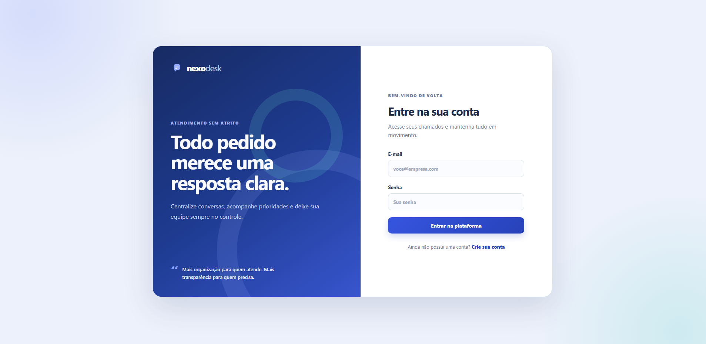
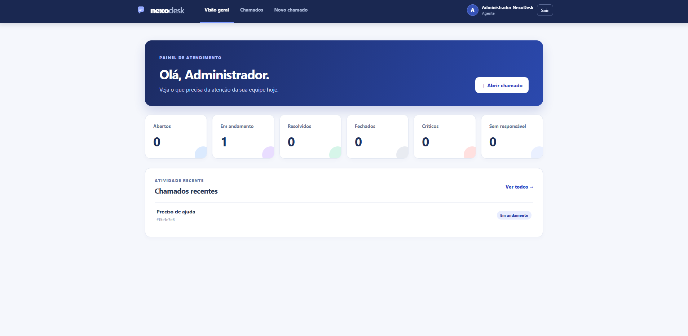

# NexoDesk | Central de Atendimento

O NexoDesk é uma central de atendimento para registrar, acompanhar e resolver chamados. Usuários abrem e acompanham suas solicitações; agentes assumem o atendimento, definem prioridade e atualizam o andamento.





## Funcionalidades

- Cadastro e autenticação com JWT e senha protegida por hash PBKDF2-SHA512.
- Perfis de acesso: `USUARIO` e `AGENTE`.
- Criação, edição, consulta, filtros e paginação de chamados.
- Atribuição de chamados, alteração de prioridade e status para agentes.
- Comentários vinculados ao chamado e bloqueio de alterações após o fechamento.
- Painel adaptado ao perfil autenticado.
- Documentação interativa da API por Swagger.

## Arquitetura

```text
React + TypeScript
        │ HTTP / JSON + JWT
ASP.NET Core Web API
        │
Application (casos de uso, DTOs e validações)
        │
Domain (entidades e regras de negócio)
        │
Infrastructure (EF Core, JWT, repositórios e migrations)
        │
SQL Server
```

O projeto é um monólito modular. As dependências seguem a direção `Api → Application → Domain`; a camada `Infrastructure` implementa os contratos definidos pela aplicação. Os controllers não acessam o `DbContext` e não retornam entidades persistidas diretamente.

```text
backend/
├── NexoDesk.Api/             # Controllers, configuração, autenticação e respostas HTTP
├── NexoDesk.Application/     # Casos de uso, contratos, DTOs e validadores
├── NexoDesk.Domain/          # Entidades, enumerações e regras de negócio
├── NexoDesk.Infrastructure/  # EF Core, migrations, repositórios, JWT e seed
└── NexoDesk.Tests/           # Testes unitários com xUnit e Moq
frontend/                     # React, TypeScript, React Router e Axios
```

## Tecnologias

- .NET 10, ASP.NET Core Web API e Entity Framework Core
- SQL Server, migrations e FluentValidation
- JWT Bearer, Swagger/OpenAPI, xUnit e Moq
- React, TypeScript, Vite, React Router e Axios
- Docker, Docker Compose e Nginx

## Execução com Docker

Pré-requisito: Docker Desktop em execução.

1. Crie as variáveis locais a partir do exemplo:

   ```powershell
   Copy-Item .env.example .env
   ```

2. Em `.env`, substitua `SA_PASSWORD` e `JWT_KEY` por valores exclusivos e fortes. A chave JWT deve ter pelo menos 32 caracteres.

3. Crie as imagens e inicie os serviços:

   ```powershell
   docker compose up --build -d
   ```

4. Acesse o sistema em `http://localhost:5173`.

| Serviço | Endereço |
| --- | --- |
| Aplicação web | http://localhost:5173 |
| API | http://localhost:8080/api |
| Swagger | http://localhost:8080/swagger |
| SQL Server | `localhost,1433` |

O serviço da API aguarda a verificação de saúde do SQL Server, aplica as migrations e cria o usuário de demonstração no ambiente de desenvolvimento.

Para parar os serviços:

```powershell
docker compose down
```

Para apagar também o banco de dados local persistido:

```powershell
docker compose down --volumes
```

> Atenção: esse último comando remove os dados locais do SQL Server.

## Acesso de desenvolvimento

Após a primeira inicialização do banco em ambiente de desenvolvimento, é criado o seguinte agente:

| Campo | Valor |
| --- | --- |
| E-mail | `admin@helpdesk.local` |
| Senha | `Admin123!` |
| Perfil | `AGENTE` |

Essas credenciais existem somente para desenvolvimento local. Altere-as ou remova o seed antes de qualquer publicação.

## Execução sem Docker

Pré-requisitos: .NET SDK 10, SQL Server ou LocalDB e Node.js.

Em um terminal, execute a API:

```powershell
dotnet restore NexoDesk.slnx
dotnet run --project backend/NexoDesk.Api
```

Em outro terminal, execute o frontend:

```powershell
Set-Location frontend
npm.cmd install
npm.cmd run dev
```

Para executar fora do Docker, configure `ConnectionStrings:HelpDeskDatabase` e `Jwt` em `backend/NexoDesk.Api/appsettings.Development.json` ou por variáveis de ambiente. Para usar uma API em outro endereço, defina `VITE_API_URL` antes de iniciar o Vite.

## API

As rotas de chamados e comentários exigem o cabeçalho `Authorization: Bearer <token>`.

| Método | Rota | Acesso | Descrição |
| --- | --- | --- | --- |
| POST | `/api/auth/register` | Público | Cria uma conta com perfil `USUARIO` e retorna um token JWT. |
| POST | `/api/auth/login` | Público | Autentica e retorna um token JWT. |
| GET | `/api/tickets` | Autenticado | Lista chamados, com filtros e paginação. |
| POST | `/api/tickets` | Autenticado | Cria um chamado. |
| GET | `/api/tickets/{id}` | Solicitante ou agente | Retorna os detalhes de um chamado. |
| PUT | `/api/tickets/{id}` | Solicitante | Atualiza título e descrição de chamado aberto. |
| PATCH | `/api/tickets/{id}/status` | Agente | Altera o status. |
| PATCH | `/api/tickets/{id}/priority` | Agente | Altera a prioridade. |
| PATCH | `/api/tickets/{id}/assign` | Agente | Atribui o chamado ao agente autenticado. |
| GET | `/api/tickets/{id}/comments` | Solicitante ou agente | Lista os comentários. |
| POST | `/api/tickets/{id}/comments` | Solicitante ou agente | Adiciona um comentário. |

Filtros aceitos em `GET /api/tickets`: `status`, `priority`, `assigned`, `page` e `pageSize`.

- Status: `ABERTO`, `EM_PROGRESSO`, `RESOLVIDO`, `FECHADO`.
- Prioridades: `BAIXA`, `MÉDIA`, `ALTA`, `CRÍTICA`.

O Swagger apresenta os contratos de entrada, respostas e a autenticação Bearer de forma interativa.

## Regras de negócio

- Usuários acessam somente os próprios chamados.
- Somente agentes podem assumir chamados ou alterar status e prioridade.
- Apenas o solicitante pode editar título e descrição, enquanto o chamado estiver aberto.
- Chamados fechados não podem ser alterados nem receber comentários.
- O fechamento registra a data em UTC.
- E-mail é único e respostas da API nunca expõem o hash da senha.

## Testes

```powershell
dotnet test backend/NexoDesk.Tests/NexoDesk.Tests.csproj
```

Os testes unitários cobrem as regras principais de autorização, atribuição, fechamento de chamados, bloqueio de comentários e e-mail duplicado.

## Decisões técnicas

- Regras de negócio isoladas da camada HTTP e da persistência.
- DTOs nas fronteiras da API para não expor o modelo do Entity Framework.
- FluentValidation centraliza a validação das entradas.
- Tratamento global de exceções produz respostas HTTP consistentes.
- Repositórios preservam a persistência fora dos controllers.
- Imagens Docker em múltiplos estágios reduzem o ambiente de execução; Nginx serve o frontend com suporte às rotas do React Router.

## Próximas melhorias

- Recuperação de senha e notificações por e-mail.
- Anexos em chamados.
- Testes de integração com SQL Server em contêiner.
- Logs estruturados, auditoria, CI/CD e implantação em nuvem.
